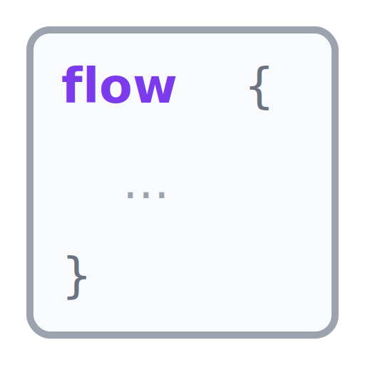

# FsFlow

> [!WARNING]
> API Still stabilising - wait for 1.0 to avoid breaking changes

<picture>
  <source media="(prefers-color-scheme: dark)" srcset="docs/content/img/fsflow-readme-dark.svg">
  <source media="(prefers-color-scheme: light)" srcset="docs/content/img/fsflow-readme-light.svg">
  
</picture>

FsFlow is a single model for Result-based programs in F#.
Write small predicate checks with `Check`, keep fail-fast logic in `Result`, accumulate sibling
validation with `Validation` and `validate {}`, then lift the same logic into `Flow`,
`AsyncFlow`, or `TaskFlow` when the boundary needs environment access, async work, task interop,
or runtime policy.

[](https://github.com/adz/FsFlow/actions/workflows/ci.yml)
[](https://www.nuget.org/packages/FsFlow)
[](LICENSE)

## Core Model

FsFlow is built around one progression:

```text
Check -> Result -> Validation -> Flow -> AsyncFlow -> TaskFlow
```

The same validation vocabulary stays the same while the execution context grows.

- Start with `Check` for reusable predicates.
- Use `Result` and `result {}` for fail-fast pure code.
- Use `Validation` and `validate {}` when sibling failures should accumulate.
- Use `flow {}` when the boundary needs typed failure and environment, but not async runtime.
- Use `asyncFlow {}` when the boundary is naturally `Async`.
- Use `taskFlow {}` when the boundary is naturally `.NET Task`.
- Keep expected failures typed all the way through instead of switching helper families at each runtime shape.

This is the key difference from split models like `Result`, `Async<Result<_,_>>`, and `Task<Result<_,_>>`
that need separate helper modules, separate builders, and repeated adaptation at the boundary.

## Install

- `FsFlow` for `Flow` and `AsyncFlow`
- `FsFlow.Net` for `TaskFlow`

## Example

Start with a reusable check and a fail-fast result:

```fsharp
open System.Threading.Tasks
open FsFlow

type RegistrationError =
    | EmailMissing
    | SaveFailed of string

let validateEmail (email: string) : Result<string, RegistrationError> =
    email
    |> Check.notBlank
    |> Result.mapErrorTo EmailMissing
```

Use the same validation logic directly inside a task-oriented workflow:

```fsharp
open System.Threading.Tasks
open FsFlow.Net

type User =
    { Email: string }

type RegistrationEnv =
    { LoadUser: int -> Task<Result<User, RegistrationError>>
      SaveUser: User -> Task<Result<unit, RegistrationError>> }

let registerUser userId : TaskFlow<RegistrationEnv, RegistrationError, unit> =
    taskFlow {
        let! loadUser = TaskFlow.read _.LoadUser
        let! saveUser = TaskFlow.read _.SaveUser

        let! user = loadUser userId
        do! validateEmail user.Email

        return! saveUser user
    }
```

`validateEmail` is just a plain `Result<string, RegistrationError>`.
`taskFlow` lifts it directly with `do!`.
There is no separate task-result validation vocabulary to learn first.

## Semantic Boundary

FsFlow is for short-circuiting, ordered workflows:

- `Check`, `Result`, `Flow`, `AsyncFlow`, and `TaskFlow` stop on the first typed failure.
- `Validation` and `validate {}` accumulate sibling failures in a structured diagnostics graph.
- The flow families are for orchestration, dependency access, async or task execution, and runtime concerns.

If you need accumulated validation, use `Validation` and `validate {}` explicitly instead of
trying to hide it inside a flow builder.

## What You Get

FsFlow stays close to standard F# and .NET:

- `flow { ... }` binds to `Result` and `Option`
- `asyncFlow { ... }` also binds to `Async` and `Async<Result<_,_>>`
- `taskFlow { ... }` binds to `Task`, `ValueTask`, `Task<_>`, `ValueTask<_>`, and `ColdTask`
- `result {}` keeps fail-fast pure code readable
- `validate {}` keeps sibling validation accumulation explicit

Because tasks are hot, FsFlow includes `ColdTask`: a small wrapper around `CancellationToken -> Task`.
`taskFlow` handles token passing for you and keeps reruns explicit.

This is the file-oriented example shape. The full runnable example is in
[`examples/FsFlow.ReadmeExample/Program.fs`](./examples/FsFlow.ReadmeExample/Program.fs).

```bash
dotnet run --project examples/FsFlow.ReadmeExample/FsFlow.ReadmeExample.fsproj --nologo
```

Supporting types in the full example are just:

- `ReadmeEnv = { Root: string }`
- `FileReadError = NotFound`

```fsharp
let readTextFile (path: string) : TaskFlow<ReadmeEnv, FileReadError, string> =
    taskFlow {
        // In production, map access and path exceptions separately at the boundary.
        do! okIf (File.Exists path) |> orElse (NotFound path) // from Validate

        return! ColdTask(fun ct -> File.ReadAllTextAsync(path, ct)) // ColdTask<string>
    }

let program : TaskFlow<ReadmeEnv, FileReadError, string * string> =
    taskFlow {
        let! root = TaskFlow.read _.Root                       // ReadmeEnv.Root -> string
        let settingsFile = Path.Combine(root, "settings.json")
        let featureFlagsFile = Path.Combine(root, "feature-flags.json")

        let! settings = readTextFile settingsFile              // TaskFlow<ReadmeEnv, FileReadError, string>
        let! featureFlags = readTextFile featureFlagsFile      // TaskFlow<ReadmeEnv, FileReadError, string>

        return settings, featureFlags                          // TaskFlow<ReadmeEnv, FileReadError, string * string>
    }
```

It reads `Root` from `'env`, performs two file reads in one `taskFlow {}`, and keeps failure typed at the boundary.

## Getting Started

- [Docs site](https://adz.github.io/FsFlow) for guides and API reference
- [`docs/VALIDATE_AND_RESULT.md`](docs/VALIDATE_AND_RESULT.md) for the validation-first story
- [`examples/`](examples/) for runnable repo examples
- [`docs/TINY_EXAMPLES.md`](docs/TINY_EXAMPLES.md) for the smallest runnable snippets
